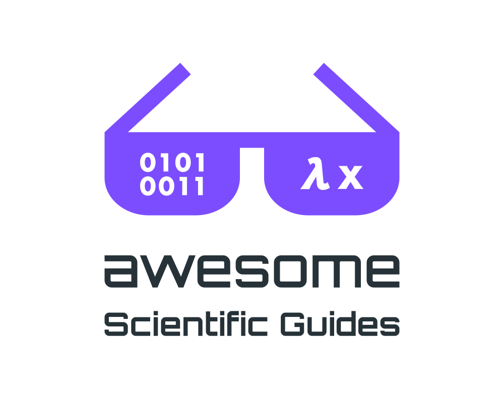

<picture>
  <source media="(prefers-color-scheme: dark)" srcset="media/logo-dark.svg">
  
</picture>
 
<h2>Guidance about conducting scientific research.</h2>

Scientists produce deliverables like publications and software artifacts.
Underlying the deliverables are many assumed research skills and principles.
This list aims to make those assumed skills and principles explicit.

For example, a research paper is a specialized format of writing.
Junior researchers, who want to write research papers, must first internalize the specification of a research paper.
Ideally, junior researchers learn these skills during doctoral studies, but in reality, doctoral study [experiences vary wildly](https://www.reddit.com/r/PhD/?f=flair_name%3A%22Seeking%20advice-academic%22).
Therefore, this collection provides a standardizing resource, for junior researchers and advisors, that is independent of institutional circumstances.
Most entries are drawn from computer science.

The list was initially curated on demand during many years of doctoral study.
To increase reach and collaboration potential, the list was converted to an [awesome list](https://awesome.re).
The list is related to a few other awesome lists ([scientific writing](https://github.com/writing-resources/awesome-scientific-writing) and [research tools](https://github.com/emptymalei/awesome-research#readme)), but is unique in its emphasis of guidance over technology.
There is also a [complementary collection](https://homes.cs.washington.edu/~mernst/advice/) of guides written by a single author.
In contrast, this list presents advice from multiple experts in many formats, and with emphasis on open access guides.

## Contents

* [Written Communication](#written-communication)
* [Giving Talks & Presentations](#giving-talks--presentations)
* [Software Artifact & Technical Guides](#software-artifact--technical-guides)
* [Review & Publishing](#review--publishing)
* [Grants & Funding](#grants--funding)
* [Academic Job Search](#academic-job-search)
* [Meta Discussions](#meta-discussions)
* [Books about Scientific Skills](#books-about-scientific-skills)

---

## Written Communication

* [Advice to Authors of Extended Abstracts](https://www.sigplan.org/Resources/Advice/Pugh/) - What is an extended abstract and what information should it contain; advice by William Pugh[^b].
* [How to Read a Paper](https://doi.org/10.1145/1273445.1273458) - The "three-pass method" for reading research papers, by S. Keshav.
* [How to Read a Technical Paper](https://www.cs.jhu.edu/~jason/advice/how-to-read-a-paper.html) - Advice about note-taking, scheduling, and choice of reading; by Jason Eisner.
* [How to Write Mathematics](https://www.stat.rice.edu/~riedi/Halmos.html) - A short checklist, and a longer exposition, of how to write mathematics; by P. R. Halmos.
* [How to Write a Technical Paper](https://neea.pl/guides/how-to-write-a-technical-paper.pdf) - Strategies for effective writing of research papers by Michael Hicks[^a].
* [Imagine the Reader](https://popl23.sigplan.org/details?action-call-with-get-request-type=1&1860ff6cd5f24c898a83af1ea68728baaction_17426506610cc6c1a558aa5dd9cfae5847110f9ad32=1&__ajax_runtime_request__=1&context=POPL-2023&track=PLMW-POPL-2023-papers&urlKey=1&decoTitle=-Imagining-the-Reader) (as [video 🎦](https://youtu.be/Q3Ye58zirjU)) - Insights about writing, when approaching it from the perspective of the reader, by Benjamin Pierce.
* [Learn Technical Writing in Two Hours per Week](https://www.cs.tufts.edu/~nr/pubs/learn-two.pdf) - A student guide explaining the mechanics of a technical writing group, by Norman Ramsey.
* [Mathematical Writing](https://jmlr.csail.mit.edu/reviewing-papers/knuth_mathematical_writing.pdf) - Course lecture notes about technical writing and the effective presentation of mathematics and computer science.
* [Shitty First Drafts](https://wrd.as.uky.edu/sites/default/files/1-Shitty%20First%20Drafts.pdf) - An illuminating characterization of the process of writing drafts, by Anne Lamott.
* [Teach Technical Writing in Two Hours per Week](https://www.cs.tufts.edu/~nr/pubs/two.pdf) - A teaching guide for motivations and mechanics of running a writing group, by Norman Ramsey.
* [The Craft of Writing Effectively 🎦](https://www.youtube.com/watch?v=vtIzMaLkCaM) - Compelling advice to improve scholarly writing, by Larry McEnerney.
* [What it's like to be a POPL referee; or how to write an extended abstract so that it is more likely to be accepted](http://doi.org/10.1145/14947.14955) - Writing advice through the eyes of a referee, by Mark Wegman[^b].
* [Writing Good Software Engineering Research Papers](https://www.cs.cmu.edu/~Compose/shaw-icse03.pdf) - A mini tutorial about writing research papers, illustrated through statistics of submitted papers; by Mary Shaw.
* [Writing Papers 🎦](https://youtu.be/ey3BEtt9QLI?t=263) - A legendary lecture about writing research papers by Leslie Lamport at Stanford in 1987.
* [Writing and Speaking with Style](https://docs.google.com/document/d/1_vBXbugoLjO171w3wovs3ugmRQI-O6EcSVFDBF7eUzE/edit?usp=sharing) - An immersive course in effective technical writing and speaking, by Benjamin C. Pierce and Rajeev Alur.

## Giving Talks & Presentations

* [Giving Technical Talks](https://www.cs.dartmouth.edu/~scot/givingTalks/) - Scot Drysdale.
* [How (not) to give a great research talk](https://popl23.sigplan.org/details/PLMW-POPL-2023-papers/3/-How-not-to-give-a-great-research-talk) (as [video 🎦](https://youtu.be/27vMdYA6RcA)) - Leonidas Lampropoulos.
* [How I Give a Talk](https://www.youtube.com/watch?v=WVnmgUakDzs) - Javier Esparza.
* [How to Present a Paper in Theoretical Computer Science](https://ianparberry.com/pubs/speaker.pdf) - Ian Parberry.
* [How to Speak 🎦](https://www.youtube.com/watch?v=Unzc731iCUY) - Patrick Winston.
* [How to give a good research talk](https://www.dmi.unict.it/barba/ProposteTesi/GOOD-TALK/giving-a-talk-slides.pdf) - Simon Peyton Jones.
* [How to give a technical presentation](https://homes.cs.washington.edu/~mernst/advice/giving-talk.html) - Michael Ernst.
* [Making a technical poster](https://homes.cs.washington.edu/~mernst/advice/poster.html) - Michael Ernst.
* [Ten simple rules for effective presentation slides](https://doi.org/10.1371/journal.pcbi.1009554) - Kristen M Naegle.

## Software Artifact & Technical Guides

* [ACM Artifact Review and Badging](https://www.acm.org/publications/policies/artifact-review-and-badging-current) - The current badging guidelines for judging scientific software artifacts, by the Association of Computing Machinery (ACM).
* [BenchExec](https://github.com/sosy-lab/benchexec) - A framework for reliable benchmarking of non-interactive tools, with built-in resource control and a table generator for visualizing results.
* [Benchmarking Crimes](https://gernot-heiser.org/benchmarking-crimes.html) - A synopsis of the many ways an experiment design or analysis can go wrong, by Gernot Heiser.
* [Can you trust your experimental results?](https://evaluate.inf.usi.ch/sites/default/files/EvaluateCollaboratoryTR1.pdf) - A general framework for validating experimental designs; a technical report developed based on the Evaluate 2011 workshop.
* [EAPLS Artifact Badges](https://eapls.org/pages/artifact_badges/) - The European scheme for software artifact evaluation.
* [Empirical Evaluation Guidelines](https://www.sigplan.org/Resources/EmpiricalEvaluation/) - A checklist to evaluate soundness of scientific experiment setup, developed by the ACM Special Interest Group on Programming Languages (SIGPLAN).
* [Empirical Standards for Software Engineering research](https://www2.sigsoft.org/EmpiricalStandards/) - The official evidence standards for conducting and reporting studies in software engineering; developed by the ACM Special Interest Group on Software Engineering (SIGSOFT).
* [Guidelines for Proof Artifacts](https://proofartifacts.github.io/guidelines/) - Proof artifacts are a special category of scientific software and thus have their own presentation standards; the guidelines are maintained by Marianna Rapoport.
* [Reliable benchmarking: requirements and solutions](https://doi.org/10.1007/s10009-017-0469-y) - Motivations for reliable benchmarking and presentation of BenchExec.
* [STABILIZER: Statistically Sound Performance Evaluation](https://people.cs.umass.edu/~emery/pubs/stabilizer-asplos13.pdf) - Curtsinger and Berger.
* [Scientific Benchmarking of Parallel Computing Systems](https://htor.inf.ethz.ch/publications/img/hoefler-scientific-benchmarking.pdf) - Best practices guide.

## Review & Publishing

* [A Guide for New Referees in Theoretical Computer Science](https://ianparberry.com/pubs/referee.pdf) - Ian Parberry.
* [Beall's List](https://beallslist.net) - A list of potential predatory journals and publishers.
* [Defining the Role of Authors and Contributors](https://www.icmje.org/recommendations/browse/roles-and-responsibilities/defining-the-role-of-authors-and-contributors.html) - Recommendations for resolving uncertainties around authorship, by International Committee of Medical Journal Editors.
* [How NOT to review a paper](https://doi.org/10.1145/1519103.1519122) - Graham Cormode.
* [Low-CO₂ research paper](https://tcs4f.org/low-co2-v1) - An initiative to draw emphasis to low environmental impact of research work.
* [Mistakes Reviewers Make](https://niklaselmqvist.medium.com/mistakes-reviewers-make-ce3a4c595aa2) - Niklas Elmqvist.
* [No free view? No review!](https://nofreeviewnoreview.org/) - A public pledge to abstain from peer reviewer with editors who paywall publications.
* [Some Lessons on Reviews and Rebuttals](https://davidstutz.de/some-lessons-on-reviews-and-rebuttals/) - David Stutz.
* [The Task of the Referee](https://ieeexplore.ieee.org/stamp/stamp.jsp?tp=&arnumber=55470&tag=1) - A.J. Smith.

## Grants & Funding

* [How to write a great research proposal](https://www.microsoft.com/en-us/research/academic-program/how-to-write-a-great-research-proposal/) - Covers e.g., proposal judging criteria and how to effectively present scientific project ideas, by Simon Peyton Jones.
* [Want to Get a Grant? Change Your Style](https://granttrainingcenter.com/blog/want-get-grant-change-style/) - A comparison of academic writing and grant writing, by Mathilda Harris.

## Academic Job Search

* [Demystifying PhD Admissions in Computer Science](https://roars.dev/phd-cs-us/demystify.pdf) - Navigating computer science PhD admissions in the United States, by ThanhVu Nguyen.
* [Faculty Job Interview Questions](https://neea.pl//guides/interview-questions.pdf) - A handout of potential interview questions, by Gursimran Walia.
* [Getting an academic job](https://homes.cs.washington.edu/~mernst/advice/academic-job.html) - Faculty job application and interview advice, by Michael Ernst.
* [Negotiating Your Job Offer(s) Inside & Outside Academia](https://neea.pl/guides/negotiating-your-job-offers.pdf) - Seminar presentation slides, by Gaeun Seo.

## Meta Discussions

* [Getting Your Research Adopted 🎦](https://youtu.be/59BZTVOM-dI) - Emery Berger's advice on helping others discover your research.
* [How Science Goes Wrong](https://www.chem.ucla.edu/dept/Faculty/merchant/pdf/How_Science_Goes_Wrong.pdf) - Discussion of the positive bias of science, in the Economist, October 2013.
* [How to Succeed in Graduate School: A Guide for Students and Advisors](https://www.eng.auburn.edu/~troppel/Advice_for_Grad_Students.pdf) - Increasing awareness of the student-advisor relationship, by Marie desJardins.
* [The Three Golden Rules for Successful Scientific Research](https://www.cs.utexas.edu/users/EWD/transcriptions/EWD06xx/EWD637.html) - Timeless grounding advice for those seeking respectable success in scientific research, by EW Dijkstra.

## Books about Scientific Skills

* [Houston, We Have a Narrative: Why Science Needs Story](https://press.uchicago.edu/ucp/books/book/chicago/H/bo21174162.html) - Randy Olson, a scientist-turned-filmmaker, highlights why scientific communication needs narrative structure.
* [Style: Lessons in Clarity and Grace](https://books.google.se/books/about/Style.html?id=HSotAAAAQBAJ&redir_esc=y) - Exercises for developing writing skills, by Bizup and Williams.
* [The Chicago Manual of Style Online](https://doi.org/10.7208/cmos18) - An excellent guide to punctuation and many other writing issues.
* [The Elements of Eloquence: How to Turn the Perfect English Phrase](https://en.wikipedia.org/wiki/The_Elements_of_Eloquence) - An excellent reference for elegant phrasing, by Mark Forsyth.
* [The Sense of Style: The Thinking Person's Guide to Writing in the 21st Century](https://stevenpinker.com/publications/sense-style-thinking-persons-guide-writing-21st-century) - A modern guide that challenges to rethink writing in many settings, including science.

---

**Is something missing?**
Although the list is already substantial, it can always be improved by contributing.
Start by reviewing the [contribution guidelines](.github/contributing.md), then open a pull request.

<!-- footnotes -->

[^a]: The presentation is based on [earlier version](https://simon.peytonjones.org/great-research-paper/) by Simon Peyton Jones.
[^b]: Although the refereeing process has changed, the impact refereeing has on writing remains relevant.  
