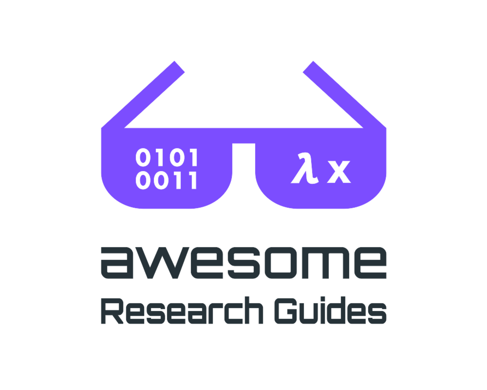
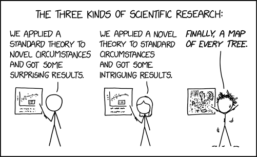

 
<a href="https://nkrusch.github.io/awesome-research-guides/"><picture class="theme-aware-logo">
  <source media="(prefers-color-scheme: dark)" srcset="assets/logo-dark.png">
  
</picture></a>
 
 <strong>Guidance about conducting scientific research.</strong>

 

Scientists produce deliverables like publications and software artifacts.
Creating the deliverables assumes many research skills and awareness of procedural principles.
The goal of this list is to make those assumed skills and principles explicit.

For example, a research paper is a specialized form of writing.
Junior researchers, who want to write research papers, must first internalize the 'specification' of a research paper.
Ideally, junior researchers learn these skills during doctoral studies.
However, in reality, doctoral study [experiences vary wildly] in environment, mentorship quality, etc.
Therefore, this collection provides a standardizing public resource, for junior researchers and advisors, that is independent of immediate circumstances.
Most entries are drawn from computer science.

This list is related to other official awesome lists (like [scientific writing] and [research tools]), but is unique in its emphasis of guidance over technology.
There are also several complementary web collections[^c] mostly written by a single author.
In contrast, this list presents advice from multiple experts, in rich formats, and enables collaborative refinement over time.
Apart from books, the list items are open access.

[^c]: Advice by [Jason Eisner](https://www.cs.jhu.edu/~jason/advice/), [Jason I. Hong](https://www.cs.cmu.edu/~jasonh/advice.html), [Michael Ernst](https://homes.cs.washington.edu/~mernst/advice/), etc.

[experiences vary wildly]: https://www.reddit.com/r/PhD/?f=flair_name%3A%22Seeking%20advice-academic%22
[scientific writing]: https://github.com/writing-resources/awesome-scientific-writing#readme
[research tools]: https://github.com/emptymalei/awesome-research#readme

## Contents

* [Written Communication](#written-communication)
* [Giving Talks & Presentations](#giving-talks--presentations)
* [Software Artifact & Technical Guides](#software-artifact--technical-guides)
* [Peer Review & Publishing Ethics](#peer-review--publishing-ethics)
* [Grants & Funding](#grants--funding)
* [Research Job Search](#research-job-search)
* [Meta Discussions](#meta-discussions)
* [Books about Scientific Skills](#books-about-scientific-skills)
* [Unwinding](#unwinding)

---

## Written Communication

* [Advice to Authors of Extended Abstracts](https://www.sigplan.org/Resources/Advice/Pugh/) - What is an extended abstract and what information should it contain; advice.
* [Conclusions](https://writingcenter.fas.harvard.edu/conclusions) - Advice on writing effective conclusions.
* [Defining the Role of Authors and Contributors](https://www.icmje.org/recommendations/browse/roles-and-responsibilities/defining-the-role-of-authors-and-contributors.html) - General recommendations for resolving uncertainties about authorship.
* [How to Read a Technical Paper](https://www.cs.jhu.edu/~jason/advice/how-to-read-a-paper.html) - Advice on selecting the reading, scheduling the reading, and taking notes.
* [How to Write Mathematics](https://entropiesschool.sciencesconf.org/data/How_to_Write_Mathematics.pdf) - An expository essay on how to write mathematics (spoiler: there is no recipe).
* [How to Write a Technical Paper](https://neea.pl/guides/how-to-write-a-technical-paper.pdf) - Strategies for effective writing of research papers.
* [How to read a paper](https://doi.org/10.1145/1273445.1273458) - The "three-pass method" for reading research papers.
* [Imagine the Reader](https://popl23.sigplan.org/details/PLMW-POPL-2023-papers/1/-Imagining-the-Reader) - Insights about writing, when approaching it from the perspective of the reader.
* [Learn Technical Writing in Two Hours per Week](https://www.cs.tufts.edu/~nr/pubs/learn-two.pdf) - A student guide explaining the mechanics of a technical writing group.
* [Mathematical Writing](https://jmlr.csail.mit.edu/reviewing-papers/knuth_mathematical_writing.pdf) - Transcribed course lecture notes on technical writing and the effective presentation of mathematics and computer science.
* [Semantic Line Breaks](https://sembr.org) - A writing style where each substantial unit of thought is separated.
* [Shitty First Drafts](https://wrd.as.uky.edu/sites/default/files/1-Shitty%20First%20Drafts.pdf) - An illuminating characterization of the process of writing drafts.
* [Small Guide to Making Nice Tables](https://people.inf.ethz.ch/markusp/teaching/guides/guide-tables.pdf) - A focused how-to to crafting more legible tables in scientific writing.
* [Teach Technical Writing in Two Hours per Week](https://www.cs.tufts.edu/~nr/pubs/two.pdf) - A teaching guide for motivations and mechanics of running a writing group.
* [The Craft of Writing Effectively](https://youtu.be/vtIzMaLkCaM) - Compelling advice to improve scholarly writing, independent of discipline.
* [Three Sins of Authors in Computer Science and Math](https://www.cs.cmu.edu/~jrs/sins.html) - Advice on avoiding some common flaws in introductions and conclusions.
* [What it's like to be a POPL referee; or how to write an extended abstract so that it is more likely to be accepted](https://doi.org/10.1145/14947.14955) - Writing advice through the eyes of a referee.
* [Writing Papers](https://youtu.be/ey3BEtt9QLI?t=263) - A legendary lecture about writing research papers.
* [Writing and Speaking with Style](https://docs.google.com/document/d/1_vBXbugoLjO171w3wovs3ugmRQI-O6EcSVFDBF7eUzE/edit?usp=sharing) - An immersive course in effective technical writing and speaking.
* [Writing good software engineering research papers](https://www.cs.cmu.edu/~Compose/shaw-icse03.pdf) - A mini tutorial about writing research papers, illustrated through statistics of submitted papers.

## Giving Talks & Presentations

* [How (not) to give a great research talk](https://youtu.be/27vMdYA6RcA) - Tips for crafting lively and engaging presentations.
* [How I Give a Talk](https://youtu.be/WVnmgUakDzs) - Using storytelling techniques to create engaging oral presentations.
* [How to Give a Great Research Talk](https://simon.peytonjones.org/great-research-talk/) - Simple actionable advice for giving better talks.
* [How to Present a Paper in Theoretical Computer Science](https://ianparberry.com/pubs/speaker.pdf) - Thematically organized advice on designing and delivering presentations.
* [How to Speak](https://youtu.be/Unzc731iCUY) - Ideas and techniques to incorporate into your speaking toolkit.
* [How to give a technical presentation](https://homes.cs.washington.edu/~mernst/advice/giving-talk.html) - Written advice about preparing and practicing for a scientific presentation, including talk-delivery and handling the Q&A session.
* [Making a technical poster](https://homes.cs.washington.edu/~mernst/advice/poster.html) - A list of things to consider while preparing and presenting a technical poster, with example posters.
* [Ten simple rules for effective presentation slides](https://doi.org/10.1371/journal.pcbi.1009554) - A rule-based "checklist" for validating your slide design.
* [The Elevator Pitch: Presenting Your Research in Conversation](https://graduateschool.nd.edu/assets/76988/elevator_pitch_8_28_2012.pdf) - Tips for crafting and delivering an elevator pitch in different situations.

## Software Artifact & Technical Guides

* [ACM Artifact Review and Badging](https://www.acm.org/publications/policies/artifact-review-and-badging-current) - The current badging guidelines for judging scientific software artifacts.
* [Artifact Evaluation: Tips for Authors](https://blog.padhye.org/Artifact-Evaluation-Tips-for-Authors/) - Ten experience-based tips, with justification and examples, for creating software artifacts.
* [BenchExec](https://github.com/sosy-lab/benchexec) - A framework for reliable benchmarking of non-interactive tools, with built-in resource control and a table generator for visualizing results.
* [Benchmarking Crimes](https://gernot-heiser.org/benchmarking-crimes.html) - A synopsis of the many ways an experiment design or analysis can go wrong.
* [Can you trust your experimental results?](https://evaluate.inf.usi.ch/sites/default/files/EvaluateCollaboratoryTR1.pdf) - A general framework for validating experimental designs; a technical report developed based on the Evaluate 2011 workshop.
* [EAPLS Artifact Badges](https://eapls.org/eapls/artifact-badges/) - The European badging scheme for software artifact evaluation.
* [Empirical Evaluation Guidelines](https://www.sigplan.org/Resources/EmpiricalEvaluation/) - A checklist to evaluate soundness of scientific experiment setup, developed.
* [Empirical Standards for Software Engineering research](https://www2.sigsoft.org/EmpiricalStandards/) - The official evidence standards for conducting and reporting studies in software engineering; developed.
* [Guide for Accelerating Computational Reproducibility in the Social Sciences](https://bitss.github.io/ACRE/) - A structured guidebook toward assessing and improving computational reproducibility.
* [Handbook for Reproduction and Replication Studies](https://forrt.org/replication-handbook/) - A practical how-to guide for how to carry out a reproduction or a replication study.
* [Proof Artifacts: Guidelines for Submission and Reviewing](https://proofartifacts.github.io/guidelines/) - Proof artifacts are a special category of scientific software and thus have their own presentation standards; the guidelines are maintained.
* [Reliable benchmarking: requirements and solutions](https://doi.org/10.1007/s10009-017-0469-y) - Motivations for reliable benchmarking and presentation of BenchExec.
* [STABILIZER: statistically sound performance evaluation](https://doi.org/10.1145/2499368.2451141) - Addressing the bias that commonly arises in measurements of effect size, i.e., the magnitude of change in performance.
* [Scientific benchmarking of parallel computing systems: twelve ways to tell the masses when reporting performance results](https://htor.inf.ethz.ch/publications/img/hoefler-scientific-benchmarking.pdf) - 12 rules of best practices for reporting empirical evaluation results.

## Peer Review & Publishing Ethics

* [A Guide for New Program Committee Members at Theoretical Computer Science Conferences](https://arxiv.org/abs/2105.02773) - A guide to help new program-committee members to understand how the system works, with useful tips and guidelines.
* [A Guide for New Referees in Theoretical Computer Science](https://ianparberry.com/pubs/referee.pdf) - Advice about peer reviewing research publication drafts, for students and other inexperienced referees.
* [After grad student suicide, misconduct findings, university suspends professor](https://retractionwatch.com/2021/03/16/after-grad-student-suicide-misconduct-findings-university-suspends-professor/) - A cautionary tale and a recount of events that exposed a serious case of research fraud.
* [Beall's List](https://beallslist.net) - A cached copy listing potential predatory journals and publishers.
* [Collusion rings threaten the integrity of computer science research](https://cacm.acm.org/opinion/collusion-rings-threaten-the-integrity-of-computer-science-research/) - Experiences discovering attempts to subvert the peer-review process.
* [Cornell Food Researcher's Downfall Raises Larger Questions For Science](https://www.npr.org/sections/thesalt/2018/09/26/651849441/cornell-food-researchers-downfall-raises-larger-questions-for-science) - This should be the cautionary tale discussed in Research Methods 101 across many disciplines.
* [Green, Gold, and Diamond Open Access](https://open-access.network/en/information/open-access-primers/green-and-gold) - A guide to understanding the different publication access models.
* [How NOT to review a paper: the tools and techniques of the adversarial reviewer](https://doi.org/10.1145/1519103.1519122) - A delightful exposition about reviewing, from the perspective of the adversarial reviewer.
* [Low-CO2 research paper](https://tcs4f.org/low-co2-v1) - An initiative to advertise the low environmental impact of research work.
* [Mistakes Reviewers Make](https://niklaselmqvist.medium.com/mistakes-reviewers-make-ce3a4c595aa2) - Reducing the learning curve for new reviewers, and helping them improve their reviewing, through exposing some common mistakes.
* [No free view? No review!](https://nofreeviewnoreview.org) - A public pledge to abstain from peer reviewing for editors who hide publications behind paywalls.
* [Reviewer-Author Collusion Rings and How to Fight Them](https://andreas-zeller.info/2025/12/07/Reviewer-Author-Collusion-Rings-and-How-to-Fight-Them.html) - A list of measures to prevent and mitigate potential collusion rings.
* [Some Lessons on Reviews and Rebuttals](https://davidstutz.de/some-lessons-on-reviews-and-rebuttals/) - Advice about writing reviews and review rebuttals.
* [The task of the referee](https://doi.org/10.1109/2.55470) - A structured framework for evaluating drafts and writing referee reports (reviews).

## Grants & Funding

* [Checklist for effectively writing grants in Stat-ML](https://stat.cmu.edu/~aramdas/checklists2/aadi-grant-checklist.pdf) - A generally applicable list of suggestions for assistant professors.
* [How to write a great research proposal](https://www.microsoft.com/en-us/research/academic-program/how-to-write-a-great-research-proposal/) - Discussion about how to effectively present scientific project ideas, including: how to approach a proposal, the judgment criteria, and common shortcomings.

## Research Job Search

* [Demystifying PhD Admissions in Computer Science](https://roars.dev/phd-cs-us/demystify.pdf) - A comprehensive manual for navigating computer science PhD admissions in the United States.
* [Faculty Job Interview Questions](https://neea.pl/guides/interview-questions.pdf) - A concise handout of potential job interview questions for a faculty position.
* [Getting an academic job](https://homes.cs.washington.edu/~mernst/advice/academic-job.html) - Information about university faculty job application and interview process in the United States.
* [Guide for the Tenure-Track Job Market in Computer/Information Sciences](https://shomir.net/tt_job_guide.html) - About seeking a faculty position for research-oriented tenure track positions in the United States.
* [Negotiating Your Job Offer(s) Inside & Outside Academia](https://neea.pl/guides/negotiating-your-job-offers.pdf) - Includes a list of various aspects that can be negotiated during a job offer.
* [Tips for Computer Science Faculty Applications](https://yisongyue.medium.com/checklist-of-tips-for-computer-science-faculty-applications-9fd2480649cc) - A guide with examples about how to prepare a faculty application package for computer science positions.

## Meta Discussions

* [Dancing With Professors: The Trouble With Academic Prose](https://web.archive.org/web/20250103165735/https://www.nytimes.com/1993/10/31/books/dancing-with-professors-the-trouble-with-academic-prose.html) - A classic dissection about the challenges of academic writing, from 1993 New York Times Book Review.
* [Getting Your Research Adopted](https://youtu.be/59BZTVOM-dI) - Advice about how to help others discover your research.
* [How Science Goes Wrong](https://www.chem.ucla.edu/dept/Faculty/merchant/pdf/How_Science_Goes_Wrong.pdf) - Discussion structural bias of science, driven by e.g., failures to replicate studies and flawed peer review.
* [How to succeed in graduate school: a guide for students and advisors: part I of II](https://www.eng.auburn.edu/~troppel/Advice_for_Grad_Students.pdf) - About optimizing the outcomes in a student-advisor relationship.
* [The Three Golden Rules for Successful Scientific Research](https://www.cs.utexas.edu/~EWD/transcriptions/EWD06xx/EWD637.html) - Timeless grounding advice for those seeking respectable success in scientific research.
* [The machines are fine. I'm worried about us.](https://ergosphere.blog/posts/the-machines-are-fine/) - Thoughtful reflections about how large language models are influencing science.

## Books about Scientific Skills

* [Houston, We Have a Narrative: Why Science Needs Story](https://press.uchicago.edu/ucp/books/book/chicago/H/bo21174162.html) - An handbook that teaches scientists how to tell effective stories about their work and why the narrative structure is needed.
* [Style: Lessons in Clarity and Grace](https://books.google.se/books/about/Style.html?id=HSotAAAAQBAJ) - Exercises for developing writing skills.
* [Stylish Academic Writing](https://www.hup.harvard.edu/books/9780674064485) - Advice on crafting clear, active sentences with concrete nouns and precise diction.
* [The Chicago Manual of Style Online](https://www.chicagomanualofstyle.org/book/ed18/frontmatter/toc.html) - An excellent guide to punctuation and many other writing issues.
* [The Craft of Research](https://press.uchicago.edu/ucp/books/book/chicago/C/bo215874008.html) - A comprehensive classic guide, with insights about, e.g., effective problem framing and use of flow in crafting persuasive arguments.
* [The Elements of Eloquence: How to Turn the Perfect English Phrase](https://en.wikipedia.org/wiki/The_Elements_of_Eloquence) - An excellent reference for elegant phrasing.
* [The Sense of Style: The Thinking Person's Guide to Writing in the 21st Century](https://stevenpinker.com/publications/sense-style-thinking-persons-guide-writing-21st-century) - A modern guide that challenges to rethink writing in many settings, including science.

## Unwinding

* [Co-authorship distance computation](https://www.csauthors.net/distance) - Discover connections between two authors in computer science (fun at conferences).
* [PhD comics](https://phdcomics.com/comics/archive_list.php) - Comics of many research-related experiences in graduate school.
* [The PhD Simulator](https://research.wmz.ninja/projects/phd/index.html) - A simulation game of the life and hurdles of an aspiring researcher.
* [xkcd](https://xkcd.com) - A web comic, with many thoughtful insights, often about science.

---

<picture>

  

</picture>
 <strong>Figure 1.</strong> <i>"Three Kinds of Research"</i> from <a href="https://xkcd.com/2977/">xkcd #2977</a>.

  

**Is something missing?** Your contributions can make the list better. 
Start by reading the [contribution guidelines](.github/contributing.md).
